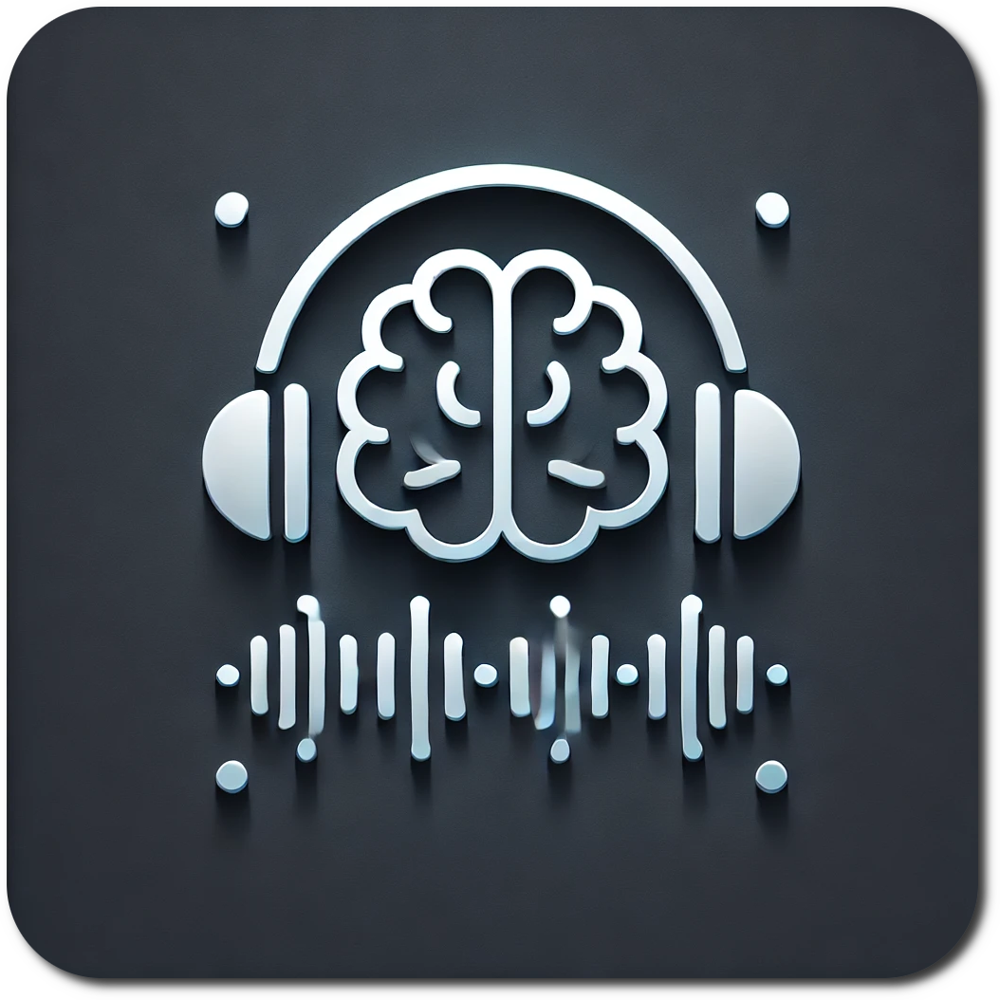

#  SBaGen+ - Sequenced Brainwave Generator

SBaGen+ is a command-line tool for generating binaural beats and isochronic tones, designed to assist with meditation, relaxation, and altering states of consciousness.

## 📑 Table of Contents

- [💡 About This Project](#-about-this-project)
- [📥 Installation](#-installation)
  - [🐳 Using SBaGen+ with Docker](#-using-sbagen-with-docker)
  - [⬇️ Download Pre-built Binaries](#️-download-pre-built-binaries)
  - [🐧 Installing on Linux](#-installing-on-linux)
  - [🍎 Installing on macOS](#-installing-on-macos)
  - [🪟 Installing on Windows](#-installing-on-windows)
- [🚀 Basic Usage](#-basic-usage)
- [📚 Documentation](#-documentation)
- [🔍 Research](#-research)
- [🛠️ Compilation](#️-compilation)
  - [📁 Build Scripts Structure](#-build-scripts-structure)
  - [🐳 Building with Docker](#-option-1-using-docker-compose-simplest-method)
  - [💻 Building Natively](#-option-2-building-natively)
- [⚖️ License](#️-license)
- [👏 Credits](#-credits)

## 💡 About This Project

SBaGen+ is a fork of the original SBaGen (Sequenced Binaural Beat Generator) created by Jim Peters. The original project has not been maintained for many years, and this fork aims to keep it functional on modern systems while preserving its original structure. Updates focus on compatibility fixes and minor feature additions requested by longtime users, without major refactoring of the original code.

The name has been changed from **"Sequenced Binaural Beat Generator"** to **"Sequenced Brainwave Generator"** to better reflect its expanded functionality. Since SBaGen+ now supports isochronic tones in addition to binaural beats, the original name no longer fully represented its capabilities.

## 📥 Installation

You can download pre-built binaries on Linux and installers for Windows and macOS from the [releases page](https://github.com/ruanklein/sbagen-plus/releases).

### 🐳 Using SBaGen+ with Docker

If you don’t want to install SBaGen+ on your machine, there’s the option to use it via Docker.

SBaGen+ for Docker was compiled without support for directly playing .sbg files. Therefore, the way to use SBaGen+ via Docker is by generating output files in RAW or WAV format.

The default image uses scratch to offer a simplified usage for most cases. Use this image if you just want to generate WAV files from your .sbg files using SBaGen+, without having to install sbagen+ on your machine.

To use .sbg files, you need to map the **/sbg** folder to your local sbg files directory, for example:

```
docker run --rm -v ./sbg:/sbg ruanklein/sbagen-plus -m river1.ogg -Wo out.wav Sleep.sbg
```

This will generate a WAV file in your sbg directory.

If you want to use media files (ogg/mp3/wav) with the -m parameter, make sure they are in the same folder as your .sbg file.

### ⬇️ Download Pre-built Binaries

The latest release (v1.5.4) can be downloaded directly from the following links:

- Linux ARM64: [sbagen+-linux-arm64](https://github.com/ruanklein/sbagen-plus/releases/download/v1.5.4/sbagen+-linux-arm64)
- Linux 32-bit: [sbagen+-linux32](https://github.com/ruanklein/sbagen-plus/releases/download/v1.5.4/sbagen+-linux32)
- Linux 64-bit: [sbagen+-linux64](https://github.com/ruanklein/sbagen-plus/releases/download/v1.5.4/sbagen+-linux64)
- macOS Installer: [SBaGen+ Installer.dmg](https://github.com/ruanklein/sbagen-plus/releases/download/v1.5.4/SBaGen+-Installer.dmg)
- Windows x86/x86_64 and ARM64: [sbagen+-windows-setup.exe](https://github.com/ruanklein/sbagen-plus/releases/download/v1.5.4/sbagen+-windows-setup.exe)

  **Important**: Always verify the SHA256 checksum of downloaded binaries against those listed on the [releases page](https://github.com/ruanklein/sbagen-plus/releases) to ensure file integrity and security.

### 🐧 Installing on Linux

1. Download the appropriate binary for your system:

   ```bash
   # For 64-bit systems
   wget https://github.com/ruanklein/sbagen-plus/releases/download/v1.5.4/sbagen+-linux64

   # For 32-bit systems
   wget https://github.com/ruanklein/sbagen-plus/releases/download/v1.5.4/sbagen+-linux32

   # For ARM64 systems
   wget https://github.com/ruanklein/sbagen-plus/releases/download/v1.5.4/sbagen+-linux-arm64
   ```

2. Verify the SHA256 checksum:

   ```bash
   sha256sum sbagen+-linux64  # Replace with your downloaded file
   # Compare the output with the checksum on the releases page
   ```

3. Make the binary executable:

   ```bash
   chmod +x sbagen+-linux64  # Replace with your downloaded file
   ```

4. Move the binary to a directory in your PATH:

   ```bash
   sudo mv sbagen+-linux64 /usr/local/bin/sbagen+  # Replace with your downloaded file
   ```

5. Verify the installation:

   ```bash
   sbagen+ -h
   ```

### 🍎 Installing on macOS

1. Download the macOS Installer: [SBaGen+ Installer.dmg](https://github.com/ruanklein/sbagen-plus/releases/download/v1.5.4/SBaGen+-Installer.dmg)

2. Verify the SHA256 checksum. You can use the `shasum` command on the terminal to verify the checksum:

   ```bash
   cd ~/Downloads
   shasum -a 256 SBaGen+-Installer.dmg
   # Compare the output with the checksum on the releases page
   ```

3. Open the DMG file and drag the `SBaGen+` application to the Applications folder.

4. Run the `SBaGen+` application from the Applications folder, accept the license agreement and click the `View Examples` button to view examples of sbg files.

5. Click in the .sbg file to play, edit or convert it. Also, you can drop sbg files on the `SBaGen+` application icon to open them.

**Important:** The `SBaGen+` application is not digitally signed, so you may need to add an exception on the `System Settings -> Security & Privacy -> General tab`.

If you want to use SBaGen+ as a command-line tool, you can create a symlink to the `sbagen+` binary in your PATH.

```bash
sudo ln -s /Applications/SBaGen+.app/Contents/Resources/bin/sbagen+ /usr/local/bin/sbagen+
```

And you can see the usage with:

```bash
sbagen+ -h
```

### 🪟 Installing on Windows

1. Download the installer:

   - [sbagen+-windows-setup.exe](https://github.com/ruanklein/sbagen-plus/releases/download/v1.5.4/sbagen+-windows-setup.exe)

2. Verify the SHA256 checksum of the installer. You can use PowerShell or Command Prompt to do this:

   ```powershell
   Get-FileHash -Algorithm SHA256 .\sbagen+-windows-setup.exe
   # Compare the output with the checksum on the releases page
   ```

3. Run the installer and follow the instructions.

⚠️ **Warning about antivirus on Windows**

Some versions of Windows Defender or other antivirus software may falsely detect `SBaGen+` as a threat.

This happens because the executable is **not digitally signed**, and as a command-line program, it may be flagged as suspicious by default.

`SBaGen+` is an open-source project, and the source code is publicly available in this repository for inspection.

✅ **Temporary solution:** if you trust the source of the executable, add an exception in your antivirus for the file or the folder where `SBaGen+` is installed.

## 🚀 Basic Usage

See [USAGE.md](USAGE.md) for more information on how to use SBaGen+.

## 📚 Documentation

For detailed information on all features, see the [SBAGEN+.txt](docs/SBAGEN+.txt) file.

## 🔍 Research

For the scientific background behind SBaGen+, check out [RESEARCH.md](RESEARCH.md).

## 🛠️ Compilation

SBaGen+ can be compiled for macOS, Linux and Windows. The build process is divided into two steps:

1. **Building the libraries**: This step is only necessary if you want MP3 and OGG support
2. **Building the main program**: This step compiles SBaGen+ using the libraries built in the previous step

### 📁 Build Scripts Structure

- **Library build scripts**:

  - `macos-build-libs.sh`: Builds libraries for macOS (universal binary - ARM64 + x86_64)
  - `linux-build-libs.sh`: Builds libraries for Linux (32-bit, 64-bit, ARM64 [if native])
  - `windows-build-libs.sh`: Builds libraries for Windows using MinGW (cross-compilation)

- **Main program build scripts**:
  - `macos-build-sbagen+.sh`: Builds SBaGen+ for macOS (universal binary - ARM64 + x86_64)
  - `linux-build-sbagen+.sh`: Builds SBaGen+ for Linux (32-bit, 64-bit, ARM64 [if native])
  - `windows-build-sbagen+.sh`: Builds SBaGen+ for Windows using MinGW (cross-compilation)

#### 🐳 Option 1: Using Docker Compose (Simplest Method)

The easiest way to build SBaGen+ for Linux and Windows is using Docker Compose:

```bash
# Build all Linux and Windows binaries with a single command
docker compose up build

# Build for Linux ARM64
docker compose up build-arm64
```

This will automatically build the Docker image and run all necessary build scripts to generate the binaries for Linux and Windows. All compiled binaries will be placed in the `dist` directory.

**For macOS**, you need compile natively. See next section for more details.

#### 💻 Option 2: Building Natively

If you prefer to build without Docker, you can use the build scripts directly on your system, provided you have all the necessary dependencies installed.

You can see the dependencies in the [Dockerfile](Dockerfile). For macOS, you need the Xcode command line tools installed and home brew installed..

The build scripts are:

```
<platform>-build-libs.sh # macOS, Linux, Windows
<platform>-build-sbagen+.sh # macOS, Linux, Windows
<platform>-create-installer.sh # macOS, Windows
```

Run the script with the `platform` you use. This will create a installers and binaries in the `dist` directory.

## ⚖️ License

SBaGen+ is distributed under the GPL license. See the [COPYING.txt](COPYING.txt) file for details.

## 👏 Credits

Original SBaGen was developed by Jim Peters. See [SBaGen project](https://uazu.net/sbagen/).

ALSA support is based from this [patch](https://github.com/jave/sbagen-alsa/blob/master/sbagen.c).
